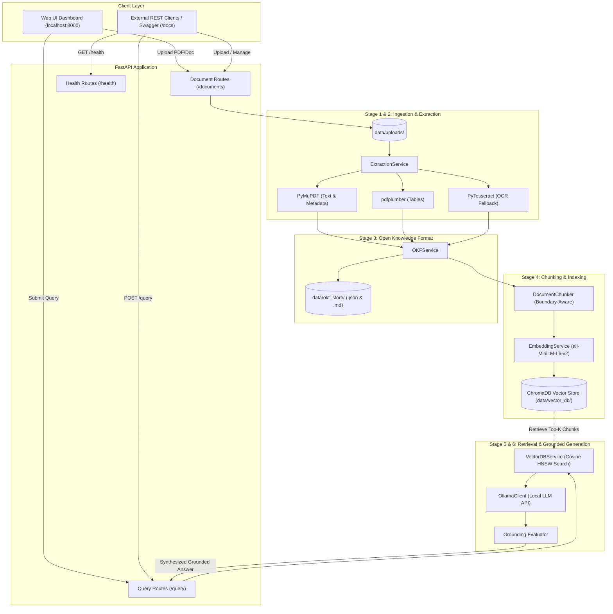

# 🧠 Enterprise RAG + LLM AI System

**A Modular, Production-Ready Retrieval-Augmented Generation (RAG) Architecture**  
*Featuring Open Knowledge Format (OKF), ChromaDB Vector Search, PyMuPDF / OCR Extraction, and Local LLM Inference via Ollama.*

---

[](https://python.org)
[](https://fastapi.tiangolo.com)
[](https://www.trychroma.com)
[](https://huggingface.co/sentence-transformers/all-MiniLM-L6-v2)
[](https://ollama.com)
[](LICENSE)

---

## 📋 Table of Contents

- [Overview](#-overview)
- [System Architecture](#-system-architecture)
- [Open Knowledge Format (OKF)](#-open-knowledge-format-okf)
- [Key Features](#-key-features)
- [Repository Structure](#-repository-structure)
- [Quick Start](#-quick-start)
  - [Prerequisites](#prerequisites)
  - [1. Installation & Environment](#1-installation--environment)
  - [2. Ollama Configuration](#2-ollama-configuration)
  - [3. Starting the Application](#3-starting-the-application)
- [Web Interface](#-web-interface)
- [API Reference & Examples](#-api-reference--examples)
  - [System Health](#1-system-health)
  - [Document Management](#2-document-management)
  - [RAG Query & LLM Generation](#3-rag-query--llm-generation)
- [Configuration Reference](#-configuration-reference)
- [Testing & Quality Assurance](#-testing--quality-assurance)
- [Deployment Guidelines](#-deployment-guidelines)
- [License & Credits](#-license--credits)

---

## 💡 Overview

The **Enterprise RAG + LLM AI System** is an end-to-end, privacy-preserving question-answering framework built for complex document workflows. 

Traditional RAG systems often suffer from **structural amnesia** (losing tables, hierarchies, and page metadata during naive text extraction) and **hallucinations** caused by poorly grounded context retrieval. This architecture solves these challenges through:

1. **Multi-Tiered Extraction**: High-speed native text parsing (PyMuPDF), structured table extraction (pdfplumber), and optical character recognition fallback (PyTesseract OCR).
2. **Open Knowledge Format (OKF)**: A standardized, dual-format (JSON + Markdown) intermediate representation that preserves provenance, section hierarchies, tables, and page boundaries.
3. **Boundary-Aware Chunking**: Intelligent text chunking that prevents splits mid-sentence or mid-table, maintaining complete semantic integrity.
4. **Vector Search & Grounded Generation**: High-density dense vector indexing in ChromaDB and strictly grounded contextual response synthesis via local Ollama models (`llama3.2`, `mistral`, `phi3`, etc.).

---

## 🏗 System Architecture



### Pipeline Flow Summary

| Stage | Component | Input | Output | Details |
|---|---|---|---|---|
| **1. Ingestion** | `IngestionService` | Raw file (PDF, TXT, MD, JSON) | Saved file in `data/uploads/` + UUID registry entry | Validates file formats, sizes, and assigns deterministic metadata. |
| **2. Extraction** | `ExtractionService` | Uploaded file | Raw pages, section titles, tables | Uses PyMuPDF for text, pdfplumber for table grids, and Tesseract for scanned PDFs. |
| **3. OKF Conversion** | `OKFService` | Extracted content | Structured `.json` + readable `.md` | Generates standardized Open Knowledge Format documents in `data/okf_store/`. |
| **4. Chunking** | `DocumentChunker` | OKF Document Model | Sentence-aligned chunk objects | Respects sentence boundaries and translates structured tables to Markdown strings. |
| **5. Vector Indexing** | `EmbeddingService` + `VectorDBService` | Text chunks | 384-dim HNSW embeddings in ChromaDB | High-performance embedding with persistent vector storage. |
| **6. Semantic Retrieval** | `VectorDBService` | Query string + filters | Top-K context chunks with metadata | Cosine similarity search with optional document-level filtering. |
| **7. LLM Synthesis** | `OllamaClient` + `Evaluator` | Retrieved chunks + user prompt | Grounded answer with source citations | Local inference with prompt grounding and fallback mechanisms. |

---

## 📦 Open Knowledge Format (OKF)

**Open Knowledge Format (OKF)** is the core intermediate representation of this system. Rather than stripping rich documents into raw strings, OKF structures all ingested documents into a lossless representation stored as both **machine-readable JSON** and **human-readable Markdown with YAML frontmatter**.

### Storage Layout

```
data/okf_store/
├── 550e8400-e29b-41d4-a716-446655440000.json    # Full Pydantic serialization
├── 550e8400-e29b-41d4-a716-446655440000.md      # Human & LLM-friendly Markdown
└── ...
```

### OKF Schema Overview

```
OKFDocument
├── metadata: OKFDocumentMetadata
│   ├── document_id: str               # Unique UUID
│   ├── filename: str                  # Original document filename
│   ├── file_type: str                 # .pdf, .txt, .md, .json
│   ├── file_size_bytes: int           # File size
│   ├── total_pages: int               # Page count
│   ├── upload_timestamp: str          # ISO 8601 UTC timestamp
│   ├── title / author: Optional[str]  # Extracted document metadata
│   └── custom_metadata: Dict          # Arbitrary user/system metadata
├── sections: List[OKFSection]
│   ├── section_id: str                # Unique Section identifier
│   ├── title: str                     # Heading text
│   ├── level: int                     # Hierarchy level (1=H1, 2=H2, etc.)
│   ├── page_number: int               # Source page number
│   └── content: str                   # Textual body
├── tables: List[OKFTable]
│   ├── table_id: str                  # Unique Table identifier
│   ├── page_number: int               # Source page number
│   ├── headers: List[str]             # Column names
│   ├── rows: List[List[str]]          # 2D cell array
│   └── caption: Optional[str]         # Table description
├── key_value_pairs: List[OKFKeyValuePair]
├── page_contents: List[OKFPageContent]
└── okf_version: "1.0"
```

### OKF Markdown Sample

```markdown
---
document_id: "9b1deb4d-3b7d-4bad-9bdd-2b0d7b3dcb6d"
filename: "annual_report.pdf"
file_type: ".pdf"
file_size_bytes: 524288
total_pages: 12
upload_timestamp: "2026-09-20T12:00:00+00:00"
okf_version: "1.0"
---

# annual_report.pdf

## Executive Summary *(Page 1)*
Revenue increased by 24% year-over-year driven by cloud service adoption...

## Financial Performance *(Page 3)*
| Quarter | Revenue ($M) | Operating Margin |
|---------|--------------|------------------|
| Q1      | 120.4        | 18.2%            |
| Q2      | 134.1        | 19.5%            |
```

---

## 🌟 Key Features

- 📄 **Multi-Format Ingestion**: Native handling for PDF, TXT, Markdown, and JSON files.
- 🔍 **Hybrid Extraction Strategy**: 
  - PyMuPDF for high-speed textual and metadata extraction.
  - pdfplumber for high-precision table grid detection and extraction.
  - PyTesseract OCR for scanned or image-only documents.
- ✂️ **Smart Sentence-Boundary Chunking**: Configurable `chunk_size` and `chunk_overlap` with sentence-boundary detection to avoid cutting sentences or data points in half.
- ⚡ **Local Semantic Vector Store**: Persistent ChromaDB instance with HNSW indexing powered by Hugging Face `sentence-transformers/all-MiniLM-L6-v2` (384 dimensions).
- 🦙 **Private Local LLM Inference**: Fully offline, privacy-first inference via Ollama (`llama3.2`, `mistral`, `llama3`, `phi3`, etc.).
- 🛡️ **Grounding & Source Citations**: Synthesized answers include explicit inline references (`[Source X, Page Y]`) to mitigate hallucination risks.
- 📊 **Modern Dark-Themed Web UI**: Built-in glassmorphic responsive interface at `http://localhost:8000` with drag-and-drop uploads, instant processing, real-time query interface, and system health monitors.
- 🩺 **Resilient Fallbacks**: Graceful degradation to context summarization if Ollama is temporarily offline.

---

## 📁 Repository Structure

```
rag-llm-ai-system/
├── .env                        # Active environment configuration
├── .env.example                # Template for environment settings
├── .gitignore                  # Git ignore rules
├── LICENSE                     # MIT License
├── README.md                   # System documentation
├── requirements.txt            # Python dependencies
├── pyproject.toml              # Build system & pytest configuration
├── test_terminal_workflow.py   # End-to-end integration test script
│
├── app/                        # Application Source Code
│   ├── __init__.py
│   ├── main.py                 # FastAPI application factory & router mounting
│   ├── config.py               # Pydantic Settings configuration loader
│   │
│   ├── api/                    # API Route Controllers
│   │   ├── __init__.py
│   │   ├── routes_health.py    # Health check & subsystem status endpoint
│   │   ├── routes_documents.py # Upload, process, list, get OKF, delete endpoints
│   │   └── routes_query.py     # Semantic search & grounded RAG endpoint
│   │
│   ├── models/                 # Pydantic Schemas & Data Models
│   │   ├── __init__.py
│   │   ├── schemas.py          # Request / response DTOs
│   │   └── okf_schema.py       # OKF schema definition & Markdown serializer
│   │
│   ├── services/               # Core Business Logic & Pipelines
│   │   ├── __init__.py
│   │   ├── ingestion.py        # File ingestion & registry persistence
│   │   ├── extraction.py       # Multi-engine document & table extractor
│   │   ├── okf.py              # OKF generator & disk persistence
│   │   ├── chunking.py         # Boundary-aware text & table chunker
│   │   ├── embeddings.py       # SentenceTransformer vector embeddings
│   │   ├── vectordb.py         # ChromaDB client & vector operations
│   │   ├── ollama_client.py    # Ollama REST API client & prompt builder
│   │   └── evaluator.py        # Groundedness & citation verification
│   │
│   └── static/                 # Embedded Web UI
│       └── index.html          # Single-page glassmorphic UI dashboard
│
├── data/                       # Local Runtime Storage (Auto-created, Git ignored)
│   ├── uploads/                # Stored raw uploaded documents
│   ├── okf_store/              # Serialized OKF records (.json & .md)
│   └── vector_db/              # Persistent ChromaDB vector data
│
└── tests/                      # Automated Test Suite
    ├── __init__.py
    ├── test_api.py             # FastAPI endpoint integration tests
    ├── test_ingestion.py       # Upload & registry unit tests
    ├── test_extraction.py      # Multi-format document parser tests
    ├── test_okf.py             # OKF generation & persistence tests
    └── test_retrieval.py       # Vector indexing & similarity search tests
```

---

## 🚀 Quick Start

### Prerequisites

| Requirement | Recommended Version | Purpose |
|---|---|---|
| **Python** | `3.10` or higher | Core runtime environment |
| **Ollama** | `0.3.0` or higher | Local LLM server |
| **Tesseract OCR** | *(Optional)* | Optical character recognition for scanned PDFs |

---

### 1. Installation & Environment

#### Step A: Clone the repository
```bash
git clone https://github.com/prathamkhatri/rag-llm-ai-system.git
cd rag-llm-ai-system
```

#### Step B: Create and activate a virtual environment
- **Windows (PowerShell):**
  ```powershell
  python -m venv venv
  .\venv\Scripts\Activate.ps1
  ```
- **Windows (Command Prompt):**
  ```cmd
  python -m venv venv
  .\venv\Scripts\activate.bat
  ```
- **Linux / macOS:**
  ```bash
  python3 -m venv venv
  source venv/bin/activate
  ```

#### Step C: Install dependencies
```bash
pip install --upgrade pip
pip install -r requirements.txt
```

#### Step D: Configure `.env`
```bash
# Copy the example configuration
cp .env.example .env
```

---

### 2. Ollama Configuration

1. **Download and install Ollama** from [ollama.com](https://ollama.com).
2. **Pull the default LLM model** (or any model configured in `.env`):
   ```bash
   ollama pull llama3.2
   ```
3. **Ensure Ollama service is running**:
   ```bash
   ollama serve
   ```

---

### 3. Starting the Application

Run the FastAPI development server:

```bash
# Using uvicorn directly
python -m uvicorn app.main:app --host 0.0.0.0 --port 8000 --reload

# Or run main.py
python app/main.py
```

Once started, access the services:
- **Interactive Web UI**: [http://localhost:8000](http://localhost:8000)
- **Interactive Swagger Docs**: [http://localhost:8000/docs](http://localhost:8000/docs)
- **ReDoc Documentation**: [http://localhost:8000/redoc](http://localhost:8000/redoc)

---

## 🖥 Web Interface

The system features an integrated single-page dashboard at `http://localhost:8000` offering:
- **Real-Time Health Status**: Monitors connection to ChromaDB and the local Ollama LLM instance.
- **Document Management**: Drag-and-drop PDF upload with automatic processing into OKF format and vector indexing.
- **Interactive Query Engine**: Ask complex questions with customizable retrieval depths (`top_k`) and document filtering.
- **Source Inspector & Provenance**: View retrieved chunks, similarity scores, page numbers, and OKF structural data.

---

## 🔌 API Reference & Examples

### 1. System Health

#### `GET /health`
Checks overall system status, ChromaDB vector collection health, and Ollama connectivity.

```bash
curl -X GET "http://localhost:8000/health"
```

**Response (`200 OK`):**
```json
{
  "status": "healthy",
  "app_name": "Enterprise RAG + LLM AI System",
  "vector_db_status": "ready (124 chunks indexed)",
  "ollama_status": "connected (model: llama3.2)",
  "ollama_model": "llama3.2",
  "timestamp": "2026-09-20T12:00:00+00:00"
}
```

---

### 2. Document Management

#### `POST /documents/upload`
Uploads a document to the server for subsequent processing.

```bash
curl -X POST "http://localhost:8000/documents/upload" \
     -H "accept: application/json" \
     -F "file=@sample_report.pdf;type=application/pdf"
```

**Response (`200 OK`):**
```json
{
  "document_id": "9b1deb4d-3b7d-4bad-9bdd-2b0d7b3dcb6d",
  "filename": "sample_report.pdf",
  "file_size_bytes": 1048576,
  "upload_timestamp": "2026-09-20T12:05:00+00:00",
  "status": "uploaded",
  "message": "Document uploaded successfully and ready for processing."
}
```

---

#### `POST /documents/process`
Executes extraction, OKF conversion, boundary-aware chunking, and ChromaDB vector indexing.

```bash
curl -X POST "http://localhost:8000/documents/process" \
     -H "Content-Type: application/json" \
     -d '{
       "document_id": "9b1deb4d-3b7d-4bad-9bdd-2b0d7b3dcb6d",
       "chunk_size": 100,
       "chunk_overlap": 30,
       "enable_ocr": true
     }'
```

**Response (`200 OK`):**
```json
{
  "document_id": "9b1deb4d-3b7d-4bad-9bdd-2b0d7b3dcb6d",
  "status": "processed",
  "sections_extracted": 8,
  "tables_extracted": 2,
  "total_chunks_indexed": 34,
  "processing_time_seconds": 1.45,
  "okf_saved": true,
  "message": "Document successfully processed, converted to OKF, and indexed in Vector DB."
}
```

---

#### `GET /documents`
Lists all uploaded documents with their processing status and chunk statistics.

```bash
curl -X GET "http://localhost:8000/documents"
```

---

#### `GET /documents/{document_id}`
Fetches the complete Open Knowledge Format (OKF) JSON representation for a document.

```bash
curl -X GET "http://localhost:8000/documents/9b1deb4d-3b7d-4bad-9bdd-2b0d7b3dcb6d"
```

---

#### `DELETE /documents/{document_id}`
Deletes the uploaded file, its OKF artifacts, and purges its indexed chunks from ChromaDB.

```bash
curl -X DELETE "http://localhost:8000/documents/9b1deb4d-3b7d-4bad-9bdd-2b0d7b3dcb6d"
```

---

### 3. RAG Query & LLM Generation

#### `POST /query`
Performs semantic vector search across indexed chunks and generates a grounded response using Ollama.

```bash
curl -X POST "http://localhost:8000/query" \
     -H "Content-Type: application/json" \
     -d '{
       "query": "What were the total quarterly revenues reported in 2025?",
       "top_k": 5,
       "document_ids": ["9b1deb4d-3b7d-4bad-9bdd-2b0d7b3dcb6d"],
       "model": "llama3.2"
     }'
```

**Response (`200 OK`):**
```json
{
  "query": "What were the total quarterly revenues reported in 2025?",
  "answer": "Based on the financial performance records [Source 1, Page 3], the total quarterly revenue reached $134.1M in Q2 2025, representing a 24% year-over-year growth.",
  "llm_model": "llama3.2",
  "retrieval_count": 5,
  "processing_time_seconds": 2.15
}
```

---

## ⚙️ Configuration Reference

All application parameters are defined in `.env` and validated using **Pydantic Settings**:

| Parameter | Type | Default | Description |
|---|---|---|---|
| `APP_NAME` | `str` | `Enterprise RAG + LLM AI System` | Title displayed in API and Swagger docs |
| `DEBUG` | `bool` | `true` | Enables FastAPI auto-reload and verbose logging |
| `PORT` | `int` | `8000` | HTTP port for the web server |
| `OLLAMA_BASE_URL` | `str` | `http://localhost:11434` | Endpoint for the local Ollama daemon |
| `OLLAMA_MODEL` | `str` | `llama3.2` | Default LLM model identifier |
| `OLLAMA_TIMEOUT_SECONDS` | `float` | `60.0` | Timeout threshold for LLM synthesis requests |
| `VECTOR_DB_DIR` | `str` | `./data/vector_db` | Disk directory for persistent ChromaDB storage |
| `EMBEDDING_MODEL_NAME` | `str` | `all-MiniLM-L6-v2` | SentenceTransformer model for chunk embeddings |
| `TOP_K_RETRIEVAL` | `int` | `4` | Default chunk retrieval count for queries |
| `UPLOAD_DIR` | `str` | `./data/uploads` | Directory for raw uploaded files |
| `OKF_STORE_DIR` | `str` | `./data/okf_store` | Directory for OKF `.json` and `.md` records |
| `MAX_UPLOAD_SIZE_MB` | `int` | `25` | Maximum allowed file upload size in megabytes |

---

## 🧪 Testing & Quality Assurance

The codebase includes comprehensive unit and integration tests covering all critical pipeline layers:

### Running Pytest Suite
```bash
# Run all tests with verbose output
pytest -v

# Run with coverage report
pytest --cov=app tests/
```

### Test Suite Breakdown

| Test File | Target Layer | Scope |
|---|---|---|
| [`tests/test_ingestion.py`](file:///tests/test_ingestion.py) | Ingestion | File validation, upload storage, and registry integrity |
| [`tests/test_extraction.py`](file:///tests/test_extraction.py) | Extraction | Multi-format text parsing, section heuristics, table parsing |
| [`tests/test_okf.py`](file:///tests/test_okf.py) | OKF Service | OKF creation, JSON serialization, Markdown generation, and reload |
| [`tests/test_retrieval.py`](file:///tests/test_retrieval.py) | Vector DB | Chunk indexing, metadata preservation, and similarity retrieval |
| [`tests/test_api.py`](file:///tests/test_api.py) | Endpoints | Full REST API integration testing via FastAPI TestClient |
| [`test_terminal_workflow.py`](file:///test_terminal_workflow.py) | End-to-End | Automated upload-to-retrieval workflow verification script |

---

## 🌐 Deployment Guidelines

### Linux / systemd Service (Production)

Create a systemd service file `/etc/systemd/system/rag-llm.service`:

```ini
[Unit]
Description=Enterprise RAG + LLM AI System
After=network.target

[Service]
User=www-data
Group=www-data
WorkingDirectory=/var/www/rag-llm-ai-system
Environment="PATH=/var/www/rag-llm-ai-system/venv/bin"
ExecStart=/var/www/rag-llm-ai-system/venv/bin/uvicorn app.main:app --host 0.0.0.0 --port 8000 --workers 4
Restart=always
RestartSec=5

[Install]
WantedBy=multi-user.target
```

Enable and start the service:
```bash
sudo systemctl daemon-reload
sudo systemctl enable rag-llm
sudo systemctl start rag-llm
```

### Nginx Reverse Proxy Configuration

```nginx
server {
    listen 80;
    server_name rag.yourdomain.com;

    client_max_body_size 50M;

    location / {
        proxy_pass http://127.0.0.1:8000;
        proxy_set_header Host $host;
        proxy_set_header X-Real-IP $remote_addr;
        proxy_set_header X-Forwarded-For $proxy_add_x_forwarded_for;
        proxy_set_header X-Forwarded-Proto $scheme;
        proxy_read_timeout 120s;
    }
}
```

---

## 📄 License & Credits

Distributed under the **MIT License**. See [`LICENSE`](LICENSE) for details.

Developed with ❤️ by **[Pratham Khatri](https://github.com/prathamkhatri)**.
